# Flickr_Elixir
### This is a Flickr's android application clone with Flutter.

### This is a part of a bigger project including [front-end](https://github.com/omarelwakil/SWFrontend) and [back-end](https://github.com/yousefwalid/SpotifyElGhalaba)

### Note: The application will no longer work as the back-end server hosting subscription has ended

# Screenshots
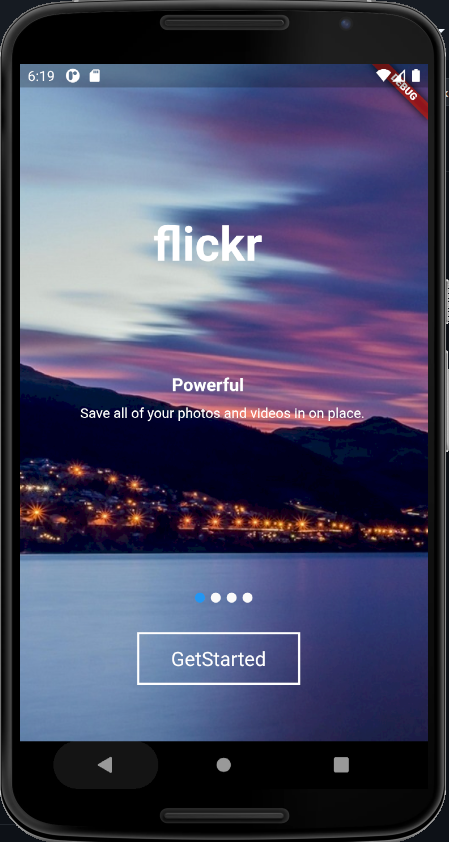 |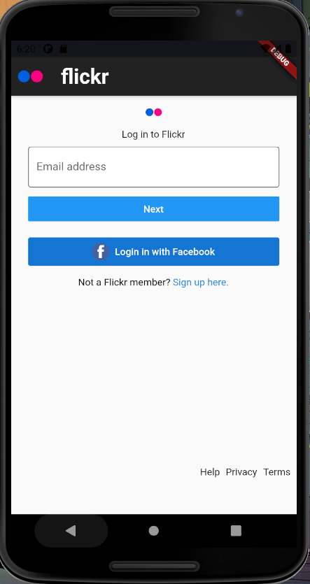 |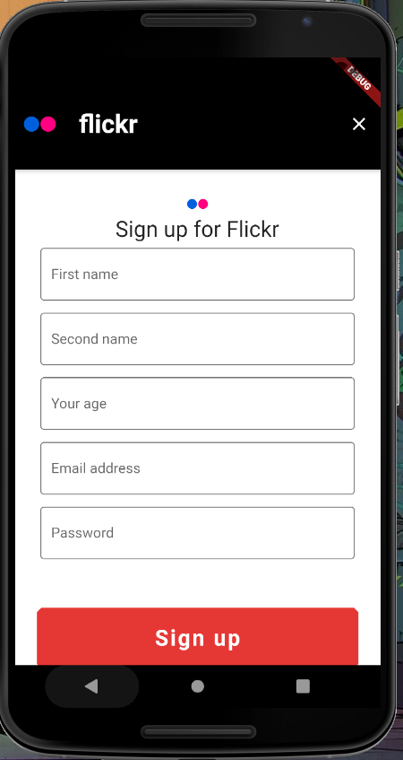
:-----------------------------:|:-----------------------------:|:-----------------------------:
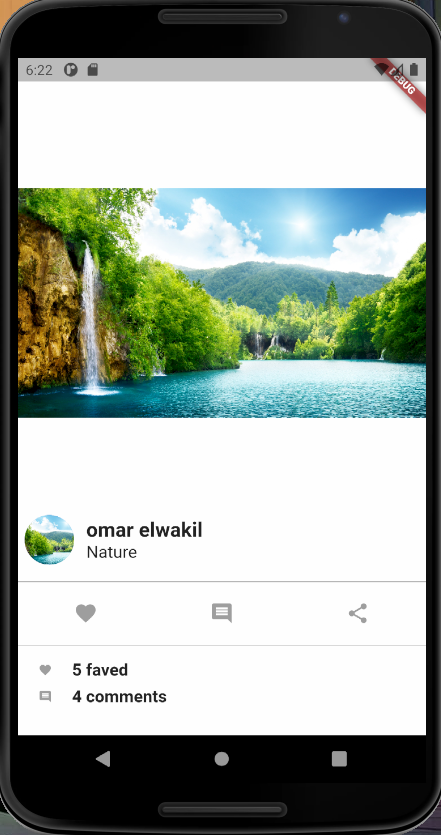 |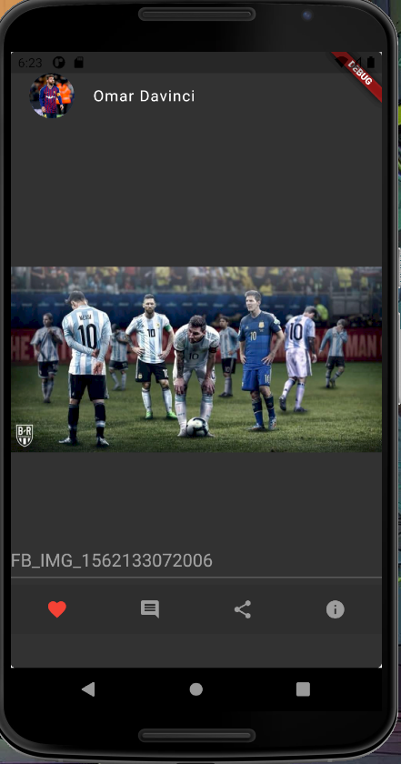 |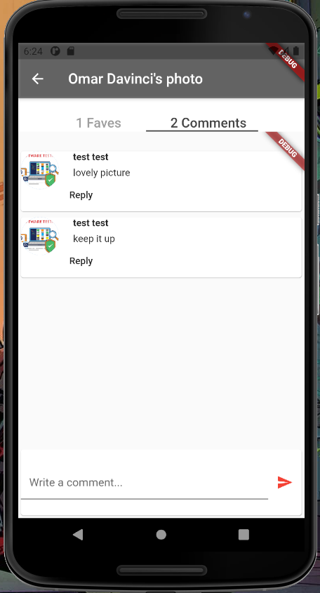
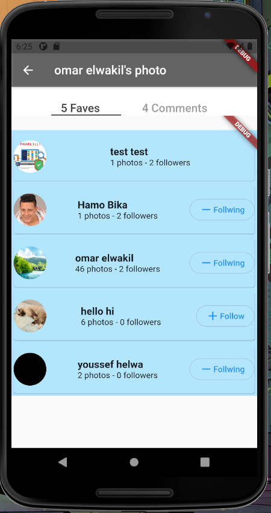 |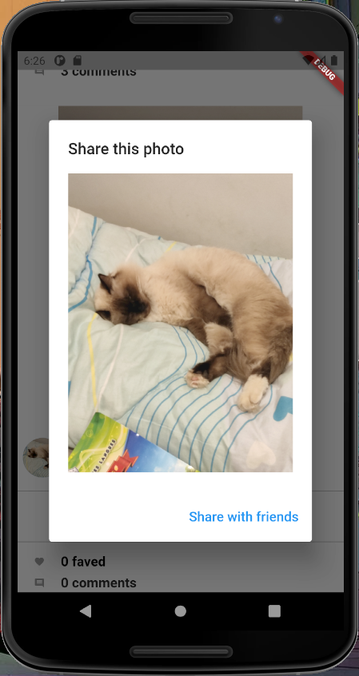 |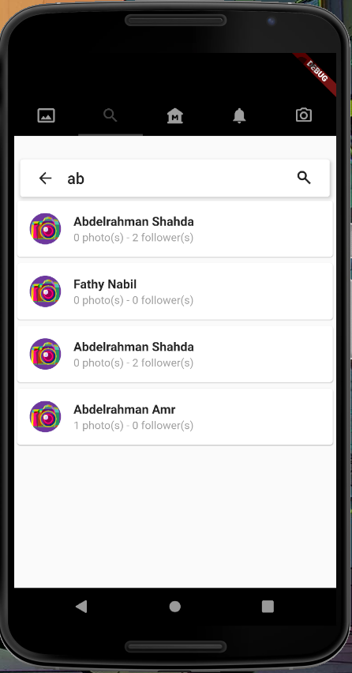
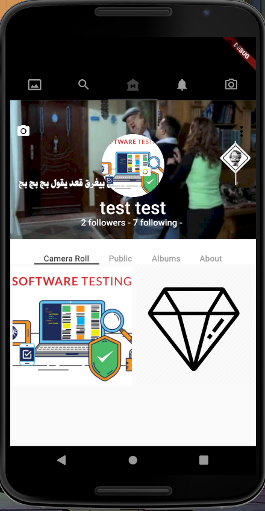 |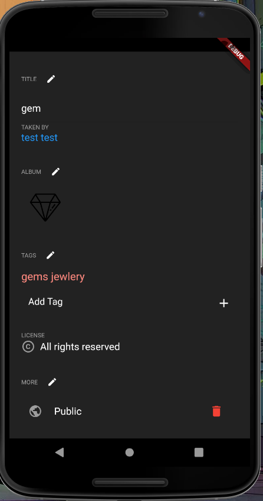 |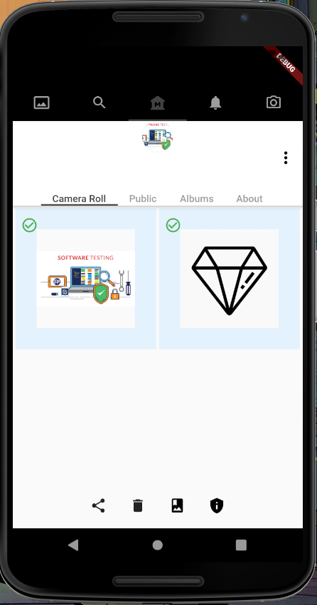
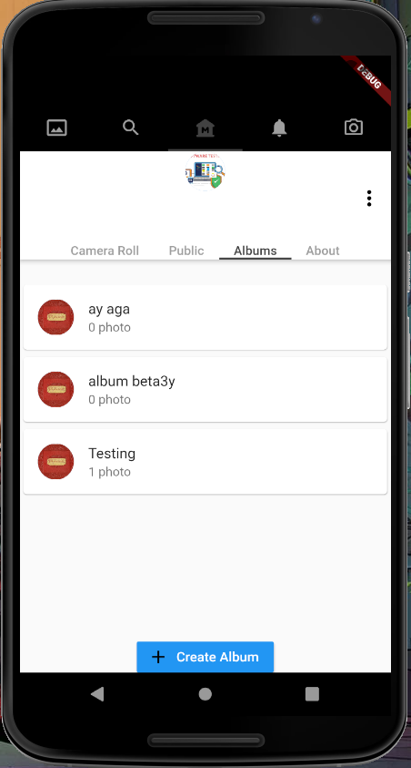 |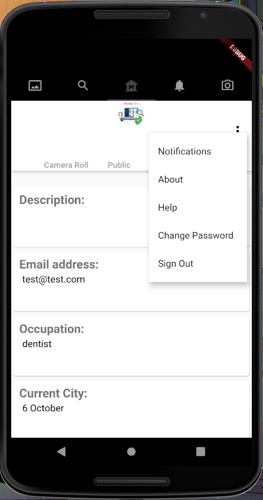 |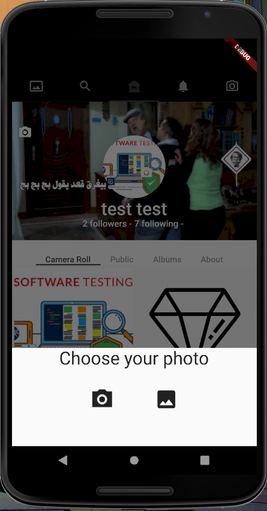

### Prerequisites
- [Android Studio 4 or higher](https://developer.android.com/studio/)
- Minimum SDK version is 21 (Android Lollipop)
- Flutter v2 and Dart SDK plugin

### How to run for developers
1. Clone the repository. 
2. Open Android Studio, click on "open" from "File" tab to open the project from the corresponding directory. 
3. Type in terminal Flutter clean and then Flutter run (to get dependencies)
4. Connect a mobile phone to the device and wait for build gradles to finish. 
5. Click on run button from the toolbar.
6. As the mobile phone is turned on, the application can be accessible.

## Running the tests
1. Go to test directory with the terminal with cd test
2. To run all tests type in the terminal flutter test
3. flutter will generate all tests and evaluate them
 
## Generating Documentation Report
1. Add to the environment variables the path of the dartdoc example: "C:\src\flutter\.pub-cache\bin"
2. Type in the terminal dartdoc 

### Build for production
1. Select main.dart file in the porject section in android studio
2. Press build then flutter then Build APK

### Used Tools and technologies
- HTTP and Flutter_FaceBook packages (Connection with REST API)
- MultiPart requests (For uploading images as URL picture) 
- Flutter_Tests (Functional testing)
- camelCase (Naming convention)
